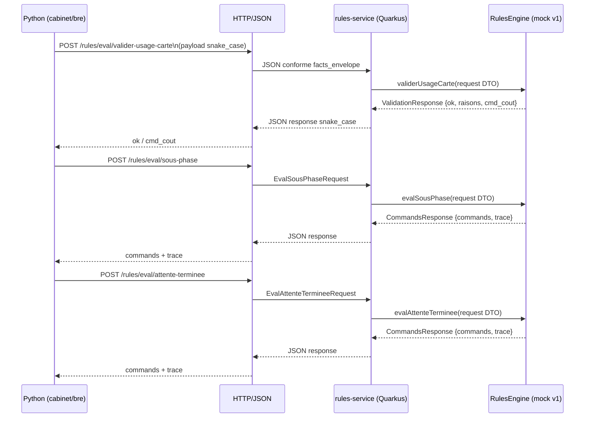

# BRE v1 — Conventions & État de Référence

Ce document sert de **mémo partagé** pour les prochaines conversations et évolutions du projet.
Il décrit **ce qui est figé en v1**, ce qui a été validé, et les règles à respecter pour ne pas casser l’intégration.

---

## 🎯 Objectif v1
Stabiliser le **contrat Python ↔ BRE (Java)** avec :
- un schéma JSON clair,
- du `snake_case` strict,
- des endpoints testés en conditions réelles (Docker).

---

## ✅ État validé (à la date du commit)
- Service **rules-service** démarre en Docker (Quarkus prod).
- Healthcheck : `/q/health` → `UP`.
- Endpoints fonctionnels :
  - `POST /rules/eval/valider-usage-carte`
  - `POST /rules/eval/sous-phase`
  - `POST /rules/eval/attente-terminee`
- Tests manuels `curl` et Python (`requests`) **OK**.
- Moteur actif : `MockRulesEngine` (volontairement simple).

---

## 📐 Conventions de contrat (FIGÉES en v1)

### 🔤 JSON
- **snake_case obligatoire**
- Pas de compat rétro (ex: pas de `commandes_cout`).

### 📤 valider-usage-carte (request)
Champs requis :
```json
{
  "source_fichier": "...",
  "analyse_skin": { "skin": "...", "version": "..." },
  "joueurs": {},
  "cmd": {}
}
```

Champs optionnels acceptés :
- `etat_min`
- `axes`
- `trace`
- `domains`
- `meta`

### 📥 valider-usage-carte (response)
```json
{
  "ok": true,
  "raisons": [],
  "cmd_cout": []
}
```

---

## 📤 eval/* (sous-phase, attente-terminee)

### Réponse standard
```json
{
  "commands": [],
  "trace": {
    "journee": 1,
    "tour": 1,
    "phase": "...",
    "sous_phase": "...",
    "pivot": "...",
    "meta": {}
  }
}
```

- `trace` est un **objet**, jamais une liste.

---

## 🧩 Java — règles structurelles
- `RulesEngine` reçoit toujours la **request complète** (DTO).
- `CommandsResponse.trace` = objet (`TraceDto`).
- `TraceDto.sous_phase` en snake_case.
- `RulesEngineProducer` :
  - `mock` = seul engine actif en v1
  - autres engines **à versionner** plus tard.

---

## 🐍 Python — règles structurelles
- Le proxy BRE :
  - envoie uniquement des payloads conformes au contrat v1
  - lit **exclusivement** `cmd_cout`
- Toute évolution de payload ⇒ **nouvelle version de contrat**.

---

## 🚫 À NE PAS FAIRE
- Renommer un champ JSON existant sans version.
- Réintroduire du camelCase.
- Ajouter de la compat silencieuse.
- Modifier la forme de `trace`.

---

## 🔜 Prochaines étapes possibles (hors v1)
- Brancher un moteur DMN/Drools réel.
- Charger dynamiquement les règles par `analyse_skin`.
- Ajouter des tests de contrat automatisés (golden JSON).
- Versionner v2 du contrat si nécessaire.

---

📌 **Règle d’or** :  
> Tant que la version du contrat ne change pas, **le JSON ne bouge pas**.

---

## 🧭 Diagramme de flux — Python ↔ BRE v1



### Lecture du diagramme
- **Python** est l’orchestrateur : il ne connaît que le contrat JSON.
- **rules-service** est un adaptateur stable (HTTP + DTO).
- **RulesEngine** (mock en v1) encapsule la logique décisionnelle.
- Les règles (DMN/DRL) seront branchées **derrière** l’engine sans modifier le contrat.

---
